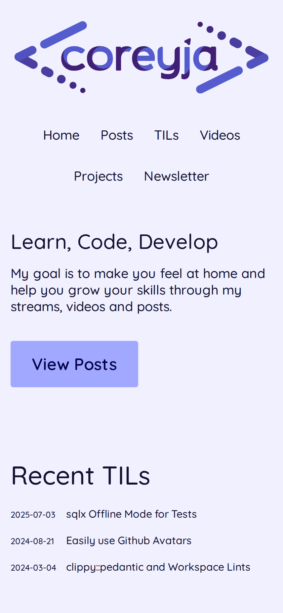

# coreyja.com

New and Hopefully Improved Personal Site

## Building

This project requires both the frontend and Rust backend to be built. The frontend must be built first as it's embedded into the Rust binary.

### Quick Start

```bash
# Build everything (frontend + Rust release build)
./scripts/build-all.sh

# For development (frontend + Rust debug build)
./scripts/dev-build.sh
```

### Manual Build Steps

If you prefer to build manually:

1. Build the frontend:
   ```bash
   cd thread-frontend
   npm install
   npm run build
   ```

2. Build the Rust backend:
   ```bash
   cargo build --release
   ```

## Screenshots

There are generated from `shot-scraper` on the 'live' site

<details><summary>iPhone</summary>


</details>

<details><summary>4K</summary>

  
</details>

<details><summary>1080p</summary>


</details>

<details><summary>iPad</summary>


</details>
