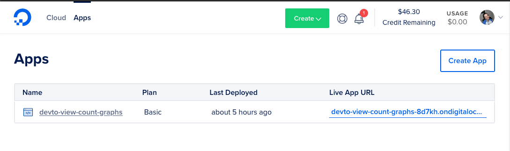
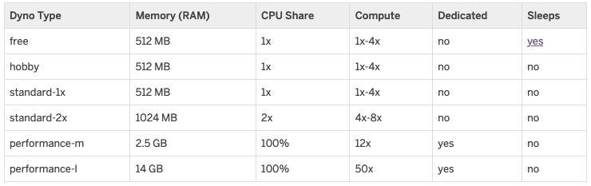

Disclaimer: I received free Digital Ocean credit for participating in the dev.to hackathon. However, this post is not related to the hackathon, and I was not compensated for it.

I have been participating in a hackathon on Dev.to, sponsored by Digital Ocean. Everyone is building apps and hosting them using Digital Ocean's new App Platform. This was my first time using the App Platform, and I wanted to write about it!

Note: For the rest of the article, I will occasionally abbreviate the Digital Ocean App Platform to DOAP.

I didn't intend for this to be a direct comparison to Heroku, but I think that's the fairest way to do this for a few reasons.
One, Heroku is a product that I use pretty much daily. I use it professionally, and it's where I usually host side projects too.
Second, App Platform _is_ basically a Heroku clone. It was going to be very difficult not to make comparisons. For instance, DOAP uses the same [Cloud Native Buildpacks](https://buildpacks.io/) (install scripts) as Heroku, and you will even see references to Heroku and Heroku documentation in your deployment logs.
While I will be comparing Heroku and Digital Ocean here, I'm gonna _try_ not to hold Digital Ocean App Platform accountable for having ALL the features of Heroku; it is a brand new product, after all. But there are some important omissions to mention later.

Before we dive in, I wanted to go over my background real quick for context. I'm mostly a Rails developer professionally, and I am on the 'Infrastructure' team at work, so I integrate closely with Heroku and am pretty familiar with their product and offerings.
Given my Rails background, this article will focus on deploying a web app with at least one background job process. For my hackathon app, I had a web process running [Puma](https://github.com/puma/puma) and a worker process running [DelayedJob](https://github.com/collectiveidea/delayed_job/).

With that said, let's dive into looking at App Platform!

## Onboarding
Creating an app is straightforward, with the caveat that you must link a Github account. Unlike Heroku, which can work off a 'plain' git push, Digital Ocean only supports adding a Github Repo. Digital Ocean uses a Github App and supports selecting only the repos you want to grant access to.

The onboarding flow asks what type of app you have, depending on what auto-detected in the repo. When I create a Rails app, I only see `Web Service` as the option, and it auto-fills the 'Run Command' to be `bundle exec rails server`. If I choose an app with a Docker file built-in, I also see a `Static Site` option. 

There are some settings here that aren't in Heroku. First, you can choose which HTTP 'prefixes' you want to mount your app on. It defaults to `/`, which likely makes sense in 99% of cases. The idea behind these prefixes is maybe you want to mount your main app to `/` and then have a separate 'component' mapped to `/admin`. This touches on another point about App Platform that I will discuss later; how apps are divided into 'Components'.
The second option that I wasn't familiar with coming from Heroku is the `HTTP Port,` which your app will listen on. This threw me for a loop for just a sec. On Heroku, you are provided a `$PORT` environment variable and are expected to listen to HTTP requests on that port. So my initial thought was that this option was for the externally exposed HTTP port. The only reason I realized it wasn't was because it was prefilled to `8080`. If it were the external facing port, I assumed it would prefill to `80` since HTTP defaults. Due to this default, I realized it was the port I was expected to listen to, but a label could have been helpful here. The [docs](https://www.digitalocean.com/docs/app-platform/concepts/http-port/) explain the port is, but this doc isn't linked from the onboarding flow.
## Architecture
An `App` is the top-level object in DOAP; this matches the semantics in Heroku.

Architecturally, 'Components' and how they live inside an 'App' are the thing that differentiates Digital Ocean's App Platform the most from Heroku. In Heroku, an 'App' is attached to a specific repo, and all the 'dynos' running under it operate on the same repo and run from the same 'base image' or container.
On DOAP, an App can have several 'Components' where each component has its own repo. A container also has a single `run` command.

This makes a Component similar to a Dyno in Heroku. For instance, both a Component and a Dyno are the 'scalable/billable unit'. This is where you decide how much RAM/CPU a container gets and how many containers you want to use of this type.

**The big difference, though, is that each Component in Digital Ocean _may_ have a distinct repo. While on Heroku, all dynos use the same repo as the base.**

This does open up some possibilities in Digital Ocean that would be much harder to replicate in Heroku. For instance, you could have a separate repo for your web process and your worker process; they could even be in different languages! But I don't want to have a separate repo for my background processes as my web ones. My business logic usually spans these two services, and having separate repos doesn't sound like a benefit.
With the route prefixing we mentioned earlier, you could also create a completely separate admin app and mount it on `/app`. This would allow you to separate the two apps at the repo level but have them accessible from the same endpoint. If I want a separate 'admin' app our otherwise, it seems almost preferred to move it to a separate domain as well, even if it's just a different sub-domain. While it does open up some interesting doors, neither of the cases I laid out are things I expect to need actually use.

A Component is also where you set environment variables, which means that for Application wide env vars, you need to supply them in EACH component. In Heroku, environment variables are configured at the app level and shared across dynos. Having them configured per component means that I have multiple places to update environment variables that apply to both be web and worker processes. It is common to have ENV vars that only apply to a single process, but they rarely conflict and make application-wide configuration difficult.

Overall, I'm not very convinced that Components make Digital Ocean a more compelling option than Heroku. In particular, I think the need to configure a repo on each individually and the fact that environment variables aren't shared will keep me returning to Heroku for its ease of use.

## Developer Experience
Heroku has, in my opinion, a great user experience. Part of this is likely my familiarity with the product, and luckily Digital Ocean is close enough that I never felt 'lost' in the product. It felt easy to navigate and use.

That said, most things in Digital Ocean App Platform felt like they lacked polish. Nothing was glaringly wrong, but it definitely feels like a new product.
For one example, I wanted to re-deploy a commit because the first deploy failed. There was no place to pick a specific commit/branch to deploy on the' Deployments' pane. There is a big `Deploy` button up top, but clicking that kicks off the deploy from your configured branch and doesn't give you options. That feels like it should satisfy the 90% case. But if I'm already looking to deploy manually, instead of using the auto-deploys, there is a  higher chance that I _do_ want to deviate from the standard path here.
### Console
The `Console` tab in the web UI is something that I found myself liking a lot that Heroku doesn't offer. This pane gives you console access to any of your running 'Components'. This allows you to do some debugging or data maintenance on the live instances. It's similar to `Heroku run`; however, the consoles do NOT get a separate container and instead use your existing live Components. This has some technical pros and cons. Since the console instance is attaching to an existing Component, there is no waiting for a console; like there is with Heroku. On the flip side, since this is reusing the Components from your app, doing any heavy processing may affect your application's performance.

In general, I tend to avoid doing heavy processing in a console, so the pros outweigh the cons for me, and I really enjoyed being able to have instant access to a console to run a quick `rake` task or open up a `rails console.`

### Logs
The logging experience in Digital Ocean Web UI seems pretty on par with what you get out of the box from Heroku. You can live to tail a process in the Web UI or via their respective CLIs. The live tail has a limited history and no search, but it works well for quick access.

However, I never rely on Heroku's built-in logger for any production-like use case and almost always opt for a third-party logging service. In Heroku, that's usually as easy as adding an add-on.
In DOAP, there doesn't seem to be an on-platform way to send logs to another source. Forcing you to configure this at the application level if it is important to you.

Due to this, I think Digital Ocean is pretty lacking in the logs department. Even adding a basic log search to their web UI would be a huge improvement if logs aren't natively shippable elsewhere. I hope this changes as the platform evolves since I view good searchable logging to be very important to monitoring and maintaining an application.

### Buildpacks

Like I mentioned earlier, Digital Ocean App Platform uses the same buildpacks as Heroku to deploy your apps. This means that most apps that can be deployed on Heroku should also be deployed on Digital Ocean. There is one big caveat, though; you can't select which buildpack(s) to use. This means you have to rely on Digital Ocean to pick the right ones for your project. It also gives you a bit less flexibility in how your app runs.
For instance, I recently configured our app at work to run using `jemalloc`, a `malloc` alternative that often has better performance for Ruby apps. We did that via a buildpack [`heroku-buildpack-jemalloc`](https://github.com/gaffneyc/heroku-buildpack-jemalloc), which allowed us to switch to `jemalloc` without any app changes.
Customizations to the build environment like this don't seem possible given the Digital Ocean App Platform's current offerings.

### Database Migrations
Another common thing that many web apps need to do is run database migrations on each deployment, add new tables or columns that might be used by the newly deployed code. In Heroku, we can specify a post-deploy task to run after the deploy, _but_ before any new containers are put into service. In Digital Ocean, there is no such configuration that I have been able to find. You can specify a build command and a run command that that is all.
It's potentially possible to have the run command be something like `bundle exec rake db:migrate && bundle exec rails server`. But this would trigger a migration in EACH container instead of once before all the containers are deployed. This isn't ideal and makes it harder to build a robust CI/CD system in Digital Ocean.

### CI/CD
Mentioning, Continuous Integration and Delivery, I came across another issue with Digital Ocean App Platform that makes it harder to recommend. Digital Ocean does prompt you to set up Continuous Delivery when you create an app. However, it seems incomplete, as it does not seem to integrate with any continuous integration testing setup. By that, I mean, when I added a test suite to my demo repo, commits that hit master would start deploying immediately BEFORE they had time to test.
For smaller projects, this may seem like only a minor annoyance. But it removes a key piece of the CI/CD pattern that I think will force people to either reinvent the wheel and figure out their own auto-deploy infrastructure or live with potentially shipping known buggy code on accident.

### Pricing
The Digital Ocean App Platform pricing is split into two halves, one for 'Basic' and one for 'Professional'. The basic version will save you a few bucks a month on a single 'Component' but will NOT let you scale horizontally, which means that you can only have a single instance of each component on the basic plans.

The cheapest DOAP plan undercuts Heroku's hobby dynos, which is great! The \$5 a month basic component has the same 512MB of RAM as Heroku, and they both have a shared single CPU, but the Heroku version is \$7. Neither of these can scale horizontally.

For \$10 a month in DOAP basic, you can get 1GB of RAM and a single vCPU; \$12 for the Pro plan. 2GB of RAM is \$20 and \$25 on the Basic and Pro plans, respectively.
These are all price points that just aren't available on Heroku and with a generous amount of RAM. Heroku's next step after Hobby is a 'Standard 1-X' dyno, which is \$25 a month and still only has 512MB of RAM. On DOAP, you get 2GB of RAM for the same \$25 a month (\$20 for the basic plan without horizontal scaling).

I'm personally attracted to DOAP for this pricing model. The big leap between Heroku's hobby dynos and their Standard-1X dynos has always thrown me off. Luckily for my wallet, none of my projects have needed to graduate from Hobby dynos. But in the future, I would like to be able to look to Digital Ocean App Platform for these small personal projects.

The bigger box prices get slightly harder to compare on paper,  mostly because Heroku doesn't publish any CPU-like stats and instead gives vague '50x compute' descriptions.

But it does still look like Digital Ocean is running cheaper for those too. Digital Ocean doesn't offer dedicated instances on the Basic plan. So the cheapest dedicated box on DOAP has 1 CPU and 4GB of RAM for \$75 a month on their Pro line. The cheapest dedicated instance on Heroku is the Performance-M, which comes with 2.5GB of RAM and 12x Compute, for \$250 a month. For only \$50 more on DOAP, you can get their biggest instance, which has 4 CPUs and 16GB of RAM. For \$300, this is a steal compared to Heroku's 14GB Performance-L dyno, which costs \$500.  
I haven't run any benchmarks to compare the instances, but you definitely get more RAM for your buck on DOAP.

One thing to look out for on Digital Ocean is bandwidth limits. On their 'Basic' Tier, you get 40GB of outbound data a month included, and 100GB on the Pro tier per app. Overages are charged at \$0.10/GB. You don't pay for bandwidth in Heroku, but there is a data cap at 2TB. For downstream-data heavy apps, this could tip pricing the scales in favor of Heroku.
## Conclusion
I'm glad to see another cloud host take a stab at the Heroku style market. I think it has a lot of value for people just looking to build apps and not care about how to get them live in front of people.

Overall I think the DOAP platform is pretty young, and the general developer experiences could be improved. I have some things I would love to see improved but wouldn't drive me from the platform, such as the environment variable configuration. However, the lack of a way to easily handle automatic Rails migrations plus the auto-deploys happening before CI makes me hesitant to use the Digital Ocean App Platform in its current form. These are definitely things that can be improved, though, and I would love to check it out again.

For personal and side projects, the pricing is really attractive. Having something cheaper than Heroku, with a decent enough clone in functionality, is definitely worth it. Especially for personal projects, where the stakes are lower, and I can 'afford' more pain in deployment work, Digital Ocean App Platform could in the future be a great choice!

For the professional side, I'm definitely not going to advocate my shop switch over anytime soon. We value the developer experience too highly to consider switching to DOAP right now. For instance, I think not having the ability to ship logs off somewhere uniformly is a hard sell for production apps. I know it can be handled at the application level, but it's just one more of the nice developer experience things that keep me liking Heroku despite their cost.

So personally, I'm going to wait on using Digital Ocean App Platform for much. I definitely want to come back and try it out for personal projects once it has had a bit of time to mature! The pricing is super competitive, and I hope they continue to improve the developer experience and work towards surpassing Heroku!
