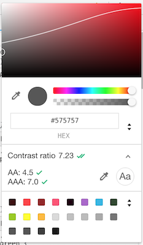
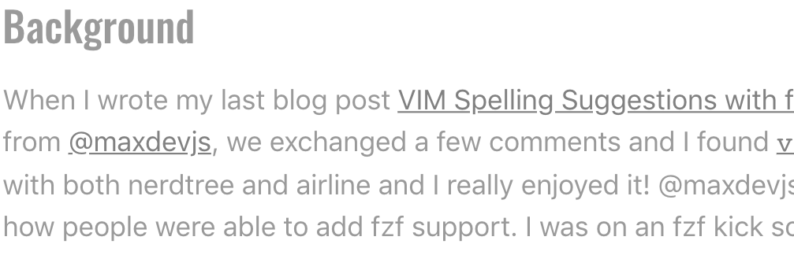
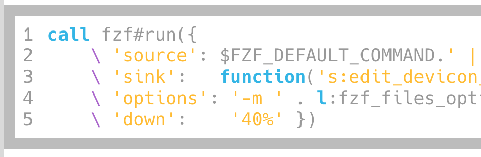

I posted my last blog post to Reddit, and one of the responses I got was about how my blog was hard to read due to the low contrast between my colors and my backgrounds. Shoutout to [@Narishma for pointing this out](https://www.reddit.com/r/rust/comments/9yek2s/using_rust_faster_devicon_file_preview_with_fzf/ea3xhpb/)!

## Automated Testing

I found this website that will check the contrast ratio of the text on your website and tell you how you are doing, [https://color.a11y.com/Contrast/](https://color.a11y.com/Contrast/). I ran this on my blog, and every color I was using for text was failing the contrast color checks.

## Chrome Devtools

It turns out that Google Chrome has some really nice tools that made it easier to adjust my color scheme. If you are looking at a font color, you can open the Color Picker and see more contrast ratio information. Here is a screenshot showing the new body font color for my blog.

You can see the current contrast ratio is 7.23. The `AA` rating is the lower acceptable value, while `AAA` is the ideal value. I tried to make sure all my colors were above the `AAA` category. With this current background color and font-size, the `AA` value is 4.5, and the `AAA` value is 7.0.
On the color chart, you can see a white line that is overlayed on the colors. This represents the `AAA` contrast ratio, if you pick any color under that curve, the contrast ratio will be greater than or equal to 7.0.

Chrome also has a built in tool for checking the contrast ratios, which I used extensively when playing around with the different colors for my blog. To access this go to the `Audits` tab in the Devtools, and select the `Accessibility` audit. One of the things this audit will do is check the contrast ratio of your font colors.

## Font Colors

I made both the body font color and the title font color, much darker grays. The header color was `#bcbcbc` and is now `#767676`. The font color was `#9a9a9a` and is now `#575757`. Here are before and after pics to showcase the differences.

Before

After

## Code Samples

The other big thing I changed is the code sample styles. I am using some of my blogs accent colors for the syntax highlighting, and most of the pastel colors I am using weren't high enough contrast on a light background. I actually prefer a dark background for code anyways, so this seemed like a good time to change it! I picked a gray that is close to black, but not a perfect black, for the background for the code samples, I ended up going with `#1a1a1a`. Then I made the code white and some of the comments gray. After this all my pastel colors had some great contrast, and all the code was much easier to read. Again here are some before and after screenshots!

Before

After

## Things to Work On

While overall I think this is a HUGE improvement over what I had before. But there are still a few things that I want to work on. One of the big ones is the color I am using for my post titles. This is currently one of my accent colors. I really like my accent colors, so I don't want to change them. However I don't think they are the best for use as font colors. Because of this I think I want to make some design changes around my blog posts, so that I can use a gray for the title color and still use my accent colors in other places.

