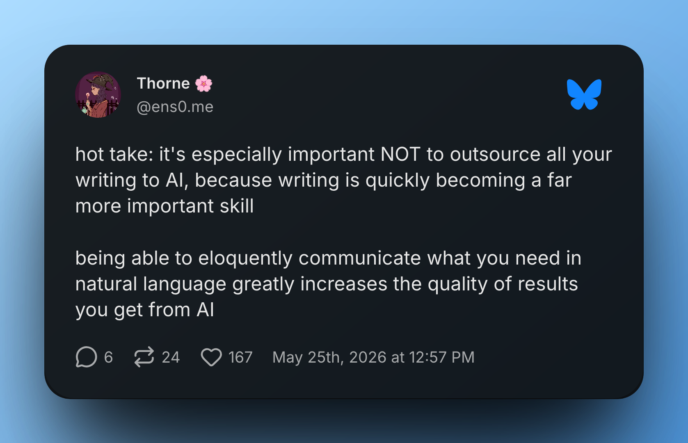
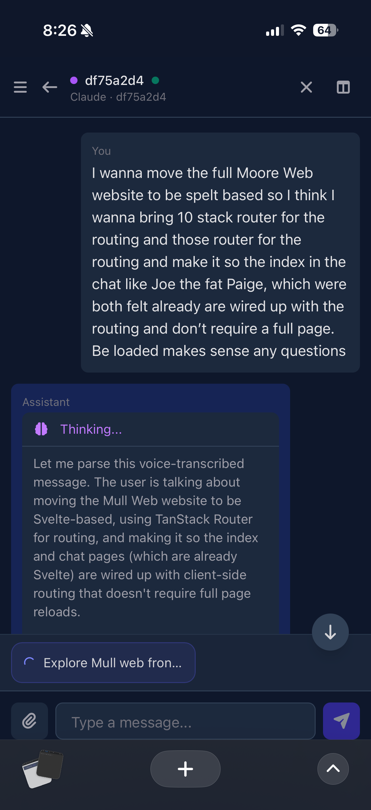

---

title: Look Ma’ no AI
subtitle: An apology, and a recommitment to writing the words myself.
author: Corey Alexander
date: 2026-05-27
atproto_uri: at://did:plc:bg2gnrjiv6htfynausierbm2/site.standard.document/look-ma-no-ai
atproto_pub_cid: bafyreifopjjfawsurumdvvfbjgpzdvwew3vbitunovjf66phveyy5nj2cu
---

I’ve flown to close to the AI sun, and this is my apology. Apology to myself, but also to all of you.

It hasn’t been a secret that I’ve been diving head first into AI in the last year. Like a good portion of the industry I’ve been using agents to do a good portion of my coding.

And I’ve had to write some “documentation” at work recently. These documents were “read once” type documents. These weren’t records I, or anyone, would want to refer to later. They were one-off documents. And Agents were able to crank these out for me!

And it felt great! Mumble a few thoughts via transcription, get a half correct prompt, let the agent figure out what I meant and write up docs. Fastest document writing process ever!

But the problem came when I let that bleed into other things. I let myself use AI to outline the written portion of my recent [podcast episodes](https://coreyja.fm). But then I wanted to get an episode released. So I let me agent wire up the draft into prose. And now that episode is released!

But I’m not happy with what I put out. It’s done, but I’m not sure my site or brand is better for it existing.

This had been eating at me. I’m currently sitting on a recorded and edited podcast episode, because I haven’t sat down and wrote the post that goes with it. It should be easy writing. The content exists, I already recorded it.

But I’m putting my foot down! The episode doesn’t get released with AI writing. Nothing in my personal portfolio gets by with AI writing anymore. That’s my personal promise to myself and all of you. [If you know me from my Youtube video streams, they historically used AI imagery for the thumbnails. I’m done with that too. Made that decision awhile ago; Podcasts thumbnails have been clean since the start.]

The “why” behind making the decision was two fold. The obvious signal came first, but I kept ignoring it.

And that’s the simple fact that AI writing is boring, and I don’t want to read it. As an AI focused dev, I see _lots_ of AI writing. It’s easy to spot. If there is a segment of the market that can ‘sense’ AI writing today, it’s developers. Not cause we have any super power here, it’s cause we are exposed to so much of it. And I don’t want to dilute my personal brand that way. I started to, and it’s time to correct the course.
And I know, this argument should have convinced me. Cause it’s how I view other content I consume.
But the temptation to ship by using a bit of AI writing was to high.

And recently I came across this Bluesky post.

[Full disclaimer my agent did help me find this post since I didn’t save it when I read it originally]

[Full Post Text](https://bsky.app/profile/ens0.me/post/3mox4n76hk24)

> hot take: it's especially important NOT to outsource all your writing to AI, because writing is quickly becoming a far more important skill
>
> being able to eloquently communicate what you need in natural language greatly increases the quality of results you get from AI

It felt like this was written for me, and was a slap in the face.

There shouldn’t have been anything ground breaking in that post. But Thorne nailed it in a way that got it to stick in my head, and I haven’t stopped thinking about it since. It’s the reason for this post. Thanks Thorne!

I think I’m a better than average AI user. And a lot of things play into that. I experimented with it early and constantly. I’ve been curious to try out new things, and I’m fine with agent experiments falling flat. And I’ve always been a decent technical writer, and someone who can translate across domains well.

That last bit is the one I’ve been stewing with recently. Writing is a muscle. And I’ve got to use it or lose it, and recently I haven’t been using it. And that’s a weird sentence to write, because I _feel_ like I have been writing a lot. Like my transcripts with AI agents are long. I _do_ have to explain myself to my agents to get good results.

But I’m realizing that mind bumping to agents, and writing polished content for other readers are in different worlds. They might as well be different games entirely. They share the medium of written words, and that’s about it.

A big part of this is that LLM’s are _crazy_ good at understanding your intent. I can transcribe a a random thought, have the transcription botch half the words and my agent will _still_ understand what I meant. It’s absurd if I’m being honest.

Look at this example. Nothing in this prompt made any sense. And yet my agent nailed it.

But publishing something like that as a blog post would make no sense. Nobody would _want_ to read that, even setting aside the question of whether they _could_ decode it.

And this practice, of going from a brain dump to a polished written document, is the bit I’ve been lacking recently. And it’s a skill that’s important to me. I think it’s a valuable one, and one I take pride in. So I’m doubling down on it.

And like Thorne suggested, I do think this will have double pay off. One, I’ll be sharpening my skills and ideally putting out written content that people _want_ to read. No more AI Slop summarizing a podcast episode. If I want a blog post to go along with a podcast episode, it’s going to be hand crafted. I’m not going to entirely rule out AI editing, but for a while I’m going to go with vegan writing, and leave off anything besides spellcheck. Including and starting with this post! Written entirely in IA Writer. No AI outline, no AI editing, nothing. Just me and the beautiful IA Writer interface.

The second payoff is that being able to articulate my thoughts, and form them into written content is exactly the skill that I think makes me valuable as an AI engineer. And I need to lean into that not away from it. Writing is a muscle, and different “types” of writing build up different muscles. Just cause I’ve been stretching a "first draft / brain dump" muscle, doesn’t mean my "polished output" muscle isn’t atrophying.

And the third “bonus” payoff, is that I enjoy writing. And I think I had forgotten that. I’ve been writing this from the train, and it’s been meditative. I haven’t been stressing about life or work, I haven’t been trying to plan my day or next project. I’ve been think deeply about this one document. Thinking about how I want to come across, how I want people to read this article and what it is I want to say. And it’s been _fun_! I miss it and need to do it more.

And I will! My promise to myself is that I’m going to stretch my writing muscles more. I need to own my writing, which for me means owning the whole process and keeping my voice. Others may be able to use AI to augment their writing process, but I don’t think I’m there yet. Maybe I’ll get there one day. But for now I need to do the full writing process end to end, and I’m excited to do it.

If you have been around for a bit, I’m sorry if my written work has left something to be desired recently. I know its left that feeling in my mouth. If you felt that way and are still reading, thanks for sticking around I really appreciate it.

The one thing I am _not_ going to promise is that I will write more volume. Cause I probably won’t. But what I write will be mine, and will be better for it. Podcast summaries might be shorter, but they will be mine and should have my voice again.

And tangentially, I want to practice more creative writing. Not cause I’m any good, or because I think the things I write will be great. I want to do it to flex the muscles and because I enjoy it. Sometimes I need to remind myself of the things I enjoy, and not let my software brain optimize away things I care about.

And I’m not going to fall for the trap of using AI to figure out how to end this article. Instead we are going to be done here, outro be damned. See ya next time Team :wave:
