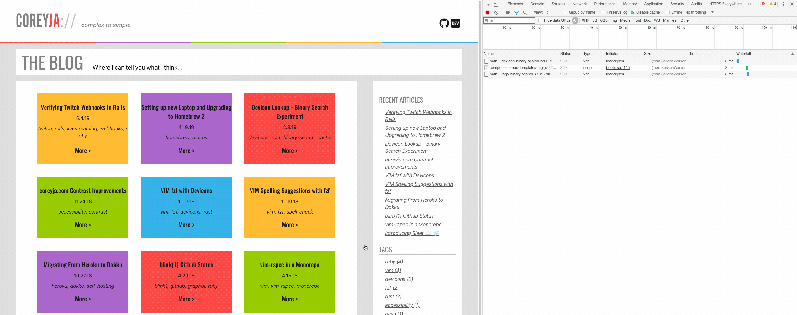

For a couple years now I've used the Middleman ruby framework to build my static blog site. I choose Middleman initially since it was a very similar environment to Rails, which I have more experience in. This definitely helped my get off the ground quickly!

But Middleman has some rough edges that I'd run into. One of the root issues is that Middleman is a slightly aging framework, and the community support is stating to lack a little bit. The other big, and related downside, is relying on the Sprockets Asset Pipeline for Javascript. As the Javascript community uses an abundance of awesome packages, when you are tied to the Asset Pipeline, you can lose the ability to use all of this open source goodness.

## Into these gaps fits Gatsby

Gatsby is a static site creator that is built around React and GraphQL, and so far I've been really enjoying it. Gatsby out of the box has some great stuff in it, but it really shines when you start adding different plugin. I started out using the [Gatsby blog template](https://github.com/gatsbyjs/gatsby-starter-blog) which already comes with a few plugins setup and configured!

## Progressive Web App

One thing that I really wanted for my blog, was to be able to use it as a Progressive Web App. There aren't too many things about a PWA that I want to use for my Blog, but one small-ish feature that was pretty important to me is the ability to have a theme color in your web manifest, which allows mobile browsers to theme the browser to match your sites color scheme

Gatsby makes it super simple to get setup with a `manifest.json` which is required for a PWA, here is the config that I am currently using:

```js
{
	resolve: `gatsby-plugin-manifest`,
	options: {
		name: `Coreyja Blog`,
		short_name: `coreyja Blog`,
		start_url: `/`,
		background_color: `#aa66cc`,
		theme_color: `#aa66cc`,
		display: `minimal-ui`,
		icon: `content/assets/favicon.svg`
	}
}
```

## Cacheing and Offline Support

This is a PWA feature that I didn't have on my old blog, and was really excited to find out that I was getting it for pretty much free in Gatsby! Using the blog template my blog was already setup and ready to go to use service workers to cache all my assets, as well as add offline support for pages that are already cached.

I was really excited to test this out, and while doing so noticed another feature that was really cool! I was playing around in the Dev Tools, and realized that just by hovering over my blog cards I was triggering network requests for the next page. It turns out Gatsby is preloading the links before the User actually clicks on them, to make the loading experience even faster!



## React Components

Its a bit surprising that I've made it this far into this post without even mentioning React Components! React seems like it's been taking over the world by storm, but I hadn't gotten a chance to really work with it before. Since this was a port of my existing blog, I already had existing styles and HTML structure for the pages, and luckily these were already broken apart into components!

I really enjoyed dipping my toes into the React world! I know I barely scratched the surface, since none of my components are very interactive. But even for my very simple components I enjoyed how React components are written and structured.

It's kinda an inversion from patterns I am used to, but React (through JSX) pushes you to intermingle your styles, HTML content and Javascript functionality. The idea is that these three make up the whole of your component, and as such should live close together! It was strangely liberating to use the HTML `style` tag to add styles to me site, without always worrying about creating a class to hold the styles I wanted to add. I didn't inline the entirety of my styles, so I did keep some in SCSS files. However I used the new (to me) idea of CSS Modules to keep them independent. The very basic idea is that you can write your css, using whatever classes make the most sense for you, without worrying about name collisions, or specificity wars. Then when you want to use the styles, you import your css file into your JSX component, and there is some behind the scenes magic to add some unique identifiers to your css classes to keep them from colliding with each other. I enjoyed this approach to css, as it stopped my from having to worry about name spacing everything manually, as this was handled by the software.

## Wrapping Up

This is kinda a long rambling post, but I wanted to write something about this port and migration while it was still fresh in my mind! There are quite a few topics I didn't get to cover, like how cool using GraphQL in Gatsby is but that can be covered in some follow up posts!

I did lose small feature or two when I ported over, but that was more cause I didn't re-implement yet them, not cause there was a limitation of the frameworks or anything! Stay tuned for some future posts about that too!
