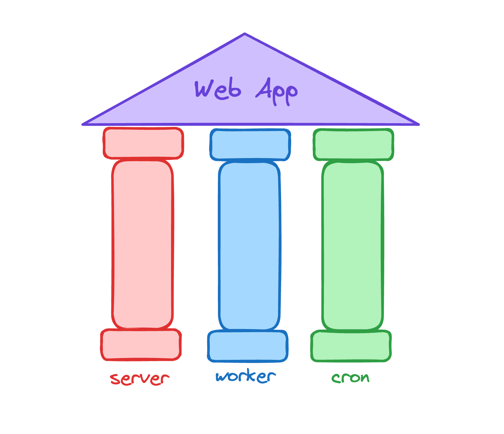

When I'm writing a web app there is an architecture I always gravitate too. It's simple yet scalable, and fits a wide array of use cases. It involves three distinct processes and one queue, in addition to whatever datastore you want to use. You can reduce the number of moving pieces by using your primary datastore as your queue, I often do this with Postgres.

As for the processes I like to call them `server`, `worker` and `cron`.

### `server`

`server` is responsible for serving your web requests. This is probably the most familiar of the three services, and is what all web frameworks will provide. It listens for new HTTP requests, and returns responses to the browser.

You want to keep those web requests as fast as possible for a good user experience. And to do that you'll often have some work that you don't want to do during a web request. The common example is sending an email after signup. We want this to happen, but we don't necessarily want to make the user wait for the email to be sent to see the next page.

### `worker`

And this is where the `worker` process comes in! This process is responsible for working of a queue of jobs. Each job should define its type and any arguments that are needed to run the job. The worker process sits in a loop looking for new things to be added to the queue and process them.

I often find it useful to give jobs a priority and work them off in some way based on that, but we'll call that an optimization. A first in first out queue is where I would start with if building a worker from scratch. Which is exactly what I'm doing for this site!

### `cron`

And the final process is `cron`. Cron's job is simple, to put new jobs in the queue based on some schedule. I often have jobs that run on some interval, like every hour. And then some that run on a specific schedule, like every morning at 6am.

## Horizontal Scaling

One thing I like about this approach is that is horizontally scales well! Both `server` and `worker` scale horizontally to fit demand. If you have more web requests, or more jobs you can simply spin up more `server` and `worker` processes.
And importantly, you scale these two processes independently! If you have more jobs than web requests, you can keep your `server` process count consistent and increase your `worker` processes.
Both of these also work well with auto-scaling if that suits the use case.

`cron` is the exception here. You do _not_ want to naively horizontally scale your `cron` process, or else you'll end up with duplicate jobs in the queue. Luckily `cron` doesn't often have scaling concerns, as it's "only" responsible for looping and enqueuing jobs when needed. If you do need to horizontally scale your cron, you can find a way to partition the jobs and assign a portion to each process you spin up.

## Guarantees

Another cool aspect of this is that you can have different durability guarantees, depending on exactly how you implement each process and which datastore you use.

For instance if you need guarantees about Cron jobs definitely being enqueued, you can write the state of the cron to your favorite data store and make sure that even if your cron goes down it can enqueue any jobs it misses when it comes back up.

You can use a durable store for your queue too, so you don't risk losing jobs. This is one reason I like Postgres queue. They are durable 'by default.'

## Simple

These three processes are relatively easy to manage, and can be applied to just about every project. I've found that basically every web app I've needed to build fits nicely into this mold, and most don't require any additional infrastructure.

My goal with setting up these three processes early, is that it reduces decision making in the future. If you already have a job queue, it's easy to take advantage of it. You never have to rely on 'hacks' like sending emails in web requests, since it's easy to offload that work to the worker process.

Like I mentioned earlier I'm currently building out these three processes for this site! It's been a lot of fun to stand up these processes from first principles, instead of using frameworks. If you want to follow along, be sure to subscribe to my newsletter or checkout my Discord!
