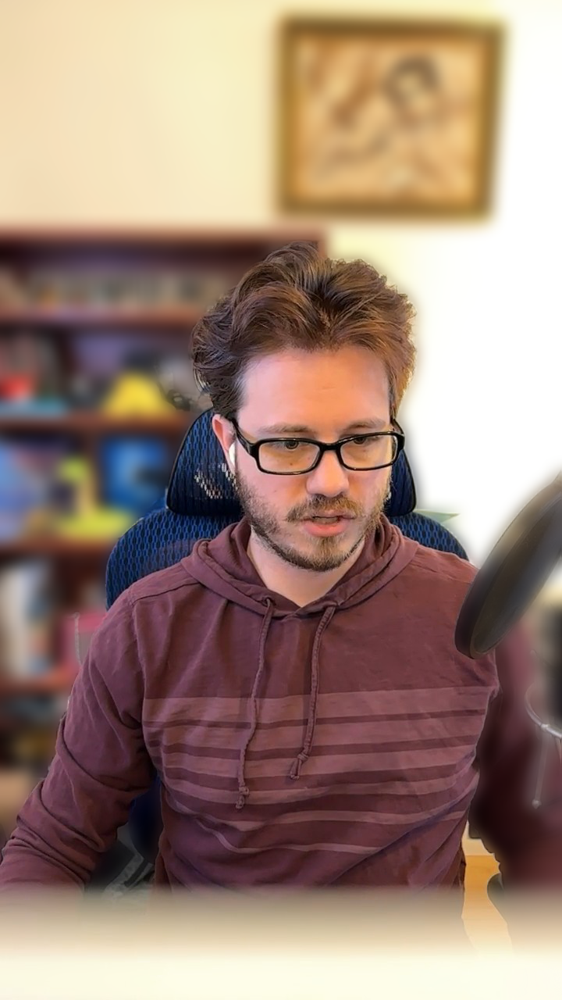

I don't have a topic to ramble on this week, but I do have a new project I've been working on!

### `rmbg`

This week I started working on a new tool I'm calling `rmbg`.
Its purpose is to remove the background in photos, and replace the background in videos.
It's basically a Rust reimplementation of the Python [`rembg`](https://github.com/danielgatis/rembg) library, with some added support for videos.
Or it will be!

Right now I've got support for "portrait mode".
A very simple implementation of Apple's Portrait mode present on iOS.
My version cuts out the background.
Then we blur the original photo, and overlay our cut-out on top.
This leaves the subject in focus, while giving their background a nice soft blur.
Here is an example still frame from a recent stream that I've run through my program.

All of this is powered by [`u2net`](https://github.com/xuebinqin/U-2-Net) which is an object detection AI model.
We are using the [`onnxruntime`](https://onnxruntime.ai) to run the model file.
I've currently been using the same models files as `rembg`.
One reason I started this project was I was hoping to speed up `rembg`.
I had noticed from the onnx runtime installation page, that the `CoreML` backend wasn't support in Python.
And since I have an M1, `CoreML` seemed like the best bet to speed up inference.
And the onnx runtime DOES support `CoreML` for their C and C++ runtime (which are what I end up consuming from Rust).

On stream on Wednesday we dug into the verbose log output of my program, and saw that `onnx` was using `CoreML`! 🎉
However we also saw that it appeared to be _faster_ when we did CPU only inference.
Because of that I've stuck with CPU for now.
But I think it's definitely worth looking into again and seeing if I was doing something wrong.

All of this is leading up to my goal, taking a video and replacing the background, portrait mode style.
But so far we've been working with static photos.

It's time for some `ffmpeg`.

`ffmpeg` this is the first time I've used `ffmpeg` to do anything more complicated that copy-pasting a StackOverflow answer.
And it made easy work of this project! See [today's TIL post](/til/ffmpeg-to-frames-and-back-again)

The basic process here is to take the video and convert it to PNGs.
Then take each PNG and run it through our portrait mode code.
And finally stitch all those PNGs back together with the original audio, and :tada: we have our portrait mode video.

Well except that each 'set' of PNGs easily takes tens or hundreds of GBs.
And removing the background from a five minute video took two and a half hours.
It's a 30 frames per second video.
But we were processing about one frame per second.

So I think next up for this project is figuring out how to speed that up.
I think I will try renting a cloud server with a GPU and seeing what kind of speeds I can get there.

Maybe I'll even turn this into a small micro SaaS, that would be cool!
