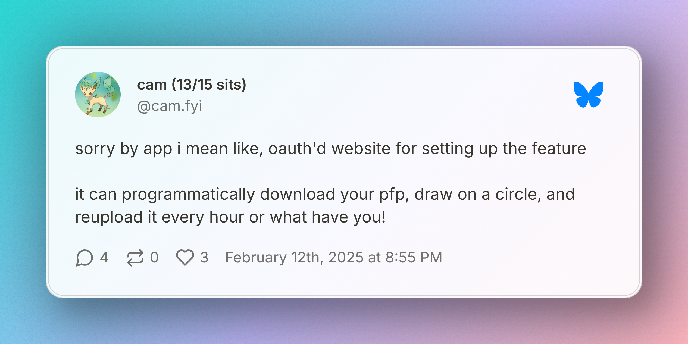

Hey Team! Look at me getting two newsletters out in one month. Let’s try and keep this up!

## Side Project Starter Kits

Last time I said that Side Project Starter Kits landing page was hopefully going to launch soon, and I was a bit too over eager with that.
There are two main reasons it didn’t get released yet.
One, I want to have more of the structure of at least one starter kit ready before I launch the landing page, so there isn’t a ton of time between getting the landing page up and having _something_ that people could at least preview if not buy.
And a related second reason, is that my interest has wondered to other projects recently. In the last couple months I’ve been trying to stop myself from wandering to other projects, trying to focus my energy on SPSK (it’s too long to keep typing out lol). And this week I realized that was doing me more harm than good! It was making a fun project to do on the side into something that I was actively avoiding, and worse it was stopping me from experimenting with things that I was more interested in!
So Side Project Start Kits are on the back burner, but ideally only for a few weeks! I’m gonna let myself enjoy a coding distraction or two, and then pull myself back to these starter kits and get one ready for you all to run with!

## pfp.blue

So what is the distraction that I’m currently exploring you ask?

It’s currently called pfp.blue, and it’s going to be a Bluesky Profile Picture app. The idea came from [this skeet](https://bsky.app/profile/cam.fyi/post/3lhzlgtcgqc2n) on Bsky from [@cam.fyi](https://bsky.app/profile/cam.fyi)

The basic idea is that we want an app that can update your profile picture automatically. The MVP is going to be adding a progress bar circle around the profile picture, that will automatically update as you update a fraction/percent in your display name.

But beyond that I think we can add different flair, or rotating profile pictures that change based on the time of day. There is a user who is doing this already, but I can’t find their profile to link it now.

I got started on that a couple days ago and making slow but good progress. So far I’ve been working on getting OAuth working so that we can authenticate with Bluesky PDS’s. This is the most complicated OAuth flow I’ve worked on, so it’s been fun to work through. The main crux of the complication is that Bsky is a distributed network, and there isn’t a central server that handles all authentication.
When doing Github Oauth for example, you register your app with Github, they supply you some secrets and then you can hit their Oauth endpoints with the secrets and get the flow going!
In Bsky there isn’t a concept of registering your app, since there are potentially thousands of PDS’s and you don’t know which your users might be using!
So instead there is a bit of a song and dance to first figure out _where_ you need to do Oauth. You find a User’s personal PDS, ask it there to send Authentication requests. And then with each request you do public key crypto to sign messages and prove it’s your app making the requests.
So far I’ve got the dance of going from a Bsky handle, to its underlying DID Document, which tells us where the PDS is hosted. And from the PDS finding out the correct authentication server. Next up is the public key crypto stuff, which I’m excited to tackle!

I’ve been “live” skeeting my progress on this in this thread over on Bsky, check it out for up to the minute updates as I work through the OAuth!

<https://bsky.app/profile/coreyja.com/post/3li3cszvdbc2k>

I want to turn my experience getting OAuth stood up into a blog post or tutorial as well, and of course will share that with you all here when it’s ready!

### Bluesky Embeds in Newsletter

This is a bit of a meta section, but thought it would be fun to chat about!

I wanted to embed two Bluesky posts into this newsletter, and as you'll see went with two different ways of doing that!

The first one up top is done via <https://postspark.app/bluesky-post> and generates an image based on the post. There are a ton of customization options, and the output looks really pretty. I like it!

For the second one I was going to be lazy and just give you a link. But Buttondown (my newsletter platform) auto-expanded it to an embed! Pretty cool too.

[If you are reading this on my site, sorry the second embed is just a link! I'll try to get Bsky embeds working on my site eventually!]

I like the visuals of Postspark more, but the simplicity of just dropping a link into the Markdown can't be beat!
