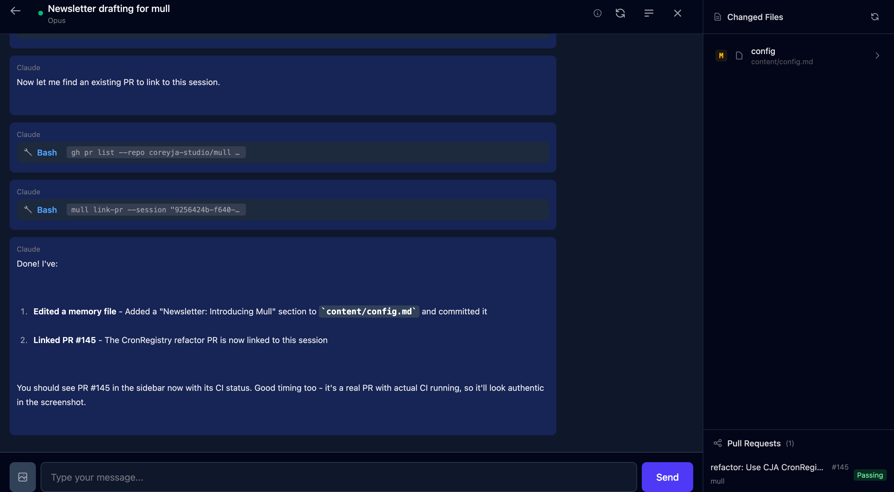

Hey Team! It's been a long time since I sent one of these, but its a new year and I want to start sending them more regularly.

And I've got a lot of things to show off, so it should be fun! I've been doing lots of LLM-driven development, and built some fun personal software. I've also taken over the Battlesnake infrastructure, [check out my recent post](https://coreyja.com/posts/battlesnake-in-2026/) to learn more about that.

And today I think I want to talk about `mull`. Mull is what I've been spending most of my time on recently. It's what I'm going to call a PDE, for Personal Development Environment. A cousin on an IDE, but unique for each user. `mull` is mine, and maybe you'll make your own.

And that's actually exactly how mull was born. I watched this [really cool video](https://www.youtube.com/watch?v=yjO9UHIunSE) by [Alex Hillman](https://www.youtube.com/@AlexHillman) about their 'JFDI System' and knew I wanted something similar. But really similar in spirit only. Most of the details are pretty different.

But that's enough of dragging it out. Here is `mull` and `Byte`: `mull` is the System and the codebase and `Byte` is my agents identity

This is Mull's web ui, and how I've been interacting with it most recently. It's also mobile friendly, and I do a large majority of my "coding" from my phone now through mull.

## Chat UI

This feature of mull is basically a version of Claude Code Web, and gives me a chat interface into a full featured Claude Code instance. It uses the json-stream mode in the official claude code CLI, and turns that into a browser based chat interface. And this is how I've been doing most of personal code development in the last 2 months, and it's been one of the most productive two months of personal coding I've ever had.

And mull doesn't have a diff view, or a code view or any kind. mull is running in a VM on my desktop, and Claude has sudo access in the VM. It even has it's own Github account so it can push and pull the code I give it access to. If you see [`byte-the-bot`](https://github.com/byte-the-bot) around my Github, that's it.

My usual workflow for implementation now involves getting a plan ready with claude through chat, and then letting it implement and open a PR when done. Then I can review it, often in the Github Mobile app. And we iterate from there, until I eventually approve the PR and Byte merges it in. We recently added a view so I can see the memory edits this session, and any PRs that got linked to the chat.

This workflow works really well for me. And I'm trying to fold more and more of the workflow into mull, so I can have it _just_ how I like it. Besides the core mull platform here are some other things we've built in the last month or two to chat about later:

- A CLI for browsing domains through the Porkbun API
- A CLI for managing my email in Fastmail
- A CLI for interacting with Nano Banana Pro, Gemini's Image Generation Model
- A Mac Menubar Tool for hosting Github Actions Runners
- A web form builder meets AI Interview app

It's been a productive time!

## Memory

The other key part of `mull`, and where it gets its name, is the memory system. mull/Claude/Byte (it gets confusing, I don't really know how to refer to these things yet to be honest) has a git repo full of Markdown that we call its memory repo. This is a repo that the agent has full push and pull access to, and is instructed in the system prompt to record to it often. There is also a system of background jobs that look at session transcripts and add info to memory as needed, which is inspiried by [Letta](https://www.letta.com/).

This memory repo has info ranging from my cats names and my daughters birthdays, to a detailed task tracker for each of my projects. And so much more.

In the Web UI, we can see details about Projects, Tasks and Plans, which make up a large portion of the "project" specific memories. I will pop into a quick web chat session, and ask Claude to create a Task for a project, or maybe an Idea if I'm less certain about it. These get created as markdown files in the repo with yml headers for metadata. And after each session we automatically push and pull the repo to sync it. This is used to backup the memory, but also because when I am running Claude Code locally I want it to have a copy of the memory as well. So Claude has access to a local clone on each of my machines that are kept in sync.

This big ball of markdown helps to orient the agents and avoid repeating myself. It gives it a place to write things down to be able to read and 'remember' next session. And its been a blast to write!

Mull is still very much a work in progress, but it's already changed how I work. The whole point of a Personal Development Environment is that it's personal - shaped by how you work, not how someone else thinks you should. Mull is mine. What would yours look like?

More on those sub-projects in future newsletters!
